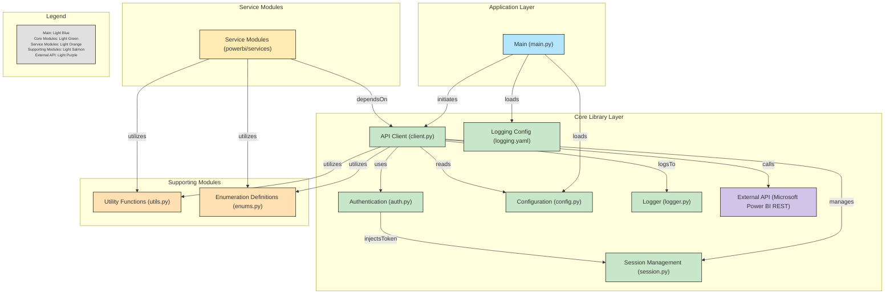

# Power Bi Python API

## Table of Contents

- [Overview](#overview)
- [Features](#features)
- [Project Structure](#project-structure)
- [Prerequisites](#prerequisites)
- [Logging](#logging)
- [Testing](#testing)
- [Future Enhancements](#future-enhancements)
- [License](#license)
- [Contact](#contact)

## Overview
This Python-based project provides an object-oriented interface for interacting with Microsoft Power BI REST APIs. It supports various operations such as managing workspaces, datasets, reports, dashboards, and more. The project is designed with modularity and maintainability in mind, featuring components like authentication, session handling, and entity-specific modules.

## Features
* Authentication: Supports token-based authentication with Microsoft Power BI REST APIs.
* Modular Services: Includes individual modules for managing:
    * Datasets
    * Dashboards
    * Reports
    * Dataflows
    * Workspaces
    * Users
* Logging: Centralized logging to both console and log files.
* Configuration: Manage API base URLs, client IDs, secrets, and other settings via a configuration file and environment variables.
* Session Management: Efficient handling of HTTP requests and authentication token injection.

## Project Structure

```
powerbi-api/
│
├── log/                              # Directory for logging outputs (log files)
│
├── powerbi/                          # Main application folder
│   ├── services/                     # Subfolder for entity-specific modules and services
│   │   ├── __init__.py               # Makes `services` a package
│   │   ├── apps.py                   # Operations related to Power BI Apps
│   │   ├── available_features.py     # Fetching/Handling available Power BI features
│   │   ├── capacities.py             # Handling capacities in Power BI (e.g., reserved resources)
│   │   ├── dashboards.py             # Operations related to dashboards
│   │   ├── dataflow_storage_accounts.py # Handling storage accounts for dataflows
│   │   ├── dataflows.py              # Operations related to Power BI Dataflows
│   │   ├── datasets.py               # Operations related to datasets
│   │   ├── groups.py                 # Managing workspace groups
│   │   ├── import.py                 # Importing resources to Power BI
│   │   ├── imports.py                # Operations for managing imported content
│   │   ├── pipelines.py              # Handling pipelines in Power BI
│   │   ├── push_datasets.py          # Handling real-time push datasets
│   │   ├── reports.py                # Operations related to reports
│   │   ├── users.py                  # Managing user access and roles
│
│   ├── __init__.py                   # Makes `powerbi` a package
│   ├── auth.py                       # Authentication logic (e.g., token-based auth for APIs)
│   ├── client.py                     # Base client for Power BI API operations
│   ├── config.py                     # Configuration (e.g., URLs, API keys)
│   ├── enums.py                      # Enumerations for Power BI entities
│   ├── logger.py                     # Centralized logging configuration
│   ├── session.py                    # Session management (e.g., HTTP requests)
│   ├── utils.py                      # Utility functions (helper methods for common tasks)
│
├── .env                              # Environment variables for sensitive info (e.g., credentials)
├── .gitignore                        # Git ignore file for excluding files from version control
├── main.py                           # Main entry point for running the application
├── README.md                         # Documentation for the project
├── requirements.txt                  # Dependencies required for the project
```

## Project Diagram


## Prerequisites
Before running the project, ensure you have the following:

* Microsoft Power BI API Access:
    * Register an app in Azure Active Directory and configure API permissions for Power BI.
    * Collect the following: Client ID, Client Secret and Tenant ID
* Add redirect URIs as needed.
* Python (>= 3.8) installed on your system.

## Logging
* Logs are written to both the console and a file (default: `log/powerbi.log`).
* Log levels can be adjusted via the `LOG_LEVEL` variable in the `.env` file (e.g., `DEBUG`, `INFO`, `ERROR`).

## Testing
To run unit tests, use the following command:

```bash
pytest tests/
```

Add test cases in the `tests/` folder for specific modules (e.g., `test_datasets.py`, `test_workspaces.py`).

## Future Enhancements
* Implement advanced error handling and retries for API requests.
* Add support for Fabrics API.
* Include examples for DAX queries and complex Power BI workflows.
* Integrate with CI/CD pipelines for testing and deployment.

## License
This project is licensed under the MIT License.

## Contact
For questions or support, please contact [trinhquocquang.buh@gmail.com](mailto:trinhquocquang.buh@gmail.com?subject=PowerBI%20API%20Ticket)
